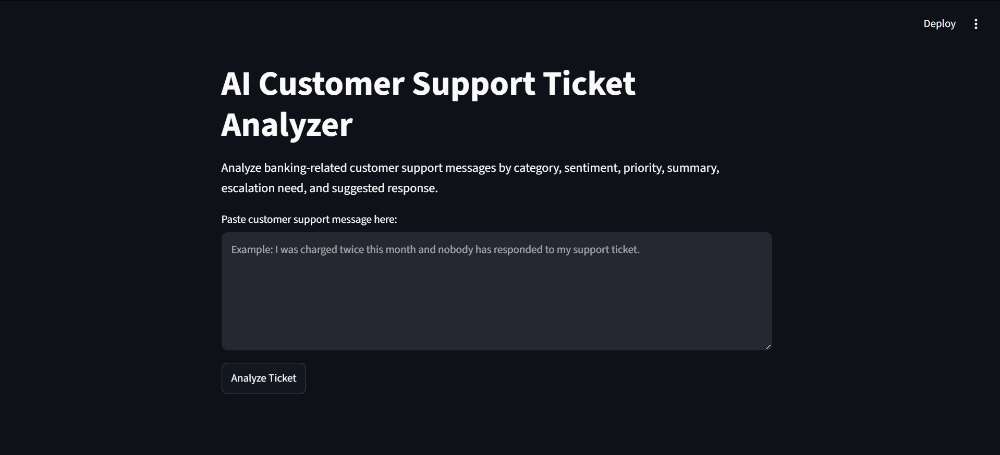
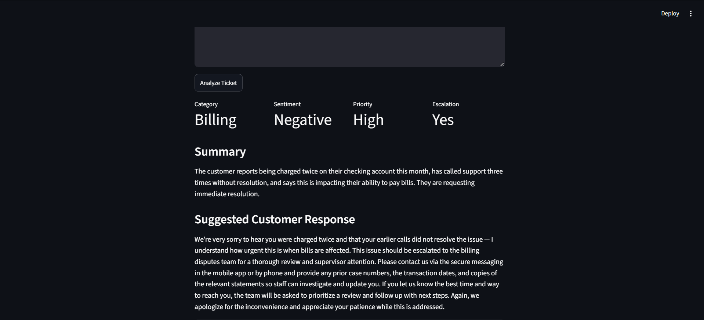
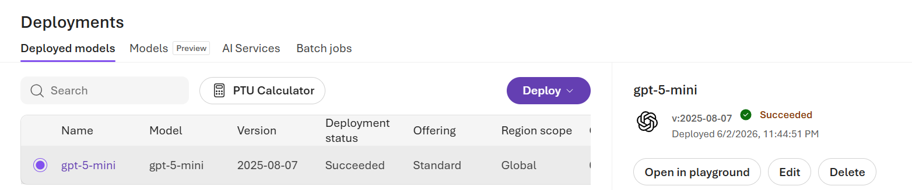

# AI Customer Support Ticket Analyzer

## Project Overview

The **AI Customer Support Ticket Analyzer** is a Streamlit web app that uses **Azure OpenAI** to analyze banking-related customer support messages. The app classifies each customer message by category, sentiment, priority, and escalation need, then generates a short ticket summary and a professional suggested customer response.

This project demonstrates how generative AI can support business operations by helping customer support teams quickly understand, route, and respond to customer issues.

## Business Use Case

Banks and credit unions receive customer messages related to billing, fraud, card issues, loans, account access, mobile app issues, and general service concerns. Manually reviewing every message can be time-consuming.

This app shows how Azure OpenAI can assist support teams by:

* Classifying customer messages by issue category
* Identifying customer sentiment
* Prioritizing tickets by urgency
* Determining whether escalation may be needed
* Summarizing customer concerns
* Drafting professional customer service responses

## Features

* Analyze a banking-related customer support message
* Classify the ticket category
* Detect sentiment
* Assign priority level
* Identify escalation need
* Generate a short ticket summary
* Generate a professional suggested response
* View raw JSON output for transparency

## Tech Stack

* Azure OpenAI
* GPT-5-mini deployment
* Python
* Streamlit
* OpenAI Python SDK
* python-dotenv
* VS Code
* uv package manager

## Project Screenshots

### App Home Page



### Sample Ticket Analysis Result



### Azure OpenAI Deployment



## Example Input

```text
I was charged twice on my checking account this month, and I already called support three times but no one has fixed it. I need this resolved immediately because it is affecting my bills.
```

## Example Output

```json
{
  "category": "Billing",
  "sentiment": "Negative",
  "priority": "High",
  "escalation_needed": "Yes",
  "summary": "The customer reports being charged twice on their checking account and is frustrated after multiple unsuccessful support attempts.",
  "suggested_response": "Thank you for reaching out. I understand how concerning and frustrating it can be to see a duplicate charge, especially when it affects your bills. This issue should be reviewed by the appropriate support team as soon as possible."
}
```

## How It Works

1. The user enters a customer support message in the Streamlit app.
2. The app sends the message to an Azure OpenAI GPT-5-mini deployment.
3. Azure OpenAI analyzes the message using a structured system prompt.
4. The model returns a JSON response containing:

   * Category
   * Sentiment
   * Priority
   * Escalation need
   * Summary
   * Suggested response
5. Streamlit displays the results in a clean interface.

## Project Structure

```text
ai-customer-support-ticket-analyzer/
│
├── app.py
├── requirements.txt
├── .gitignore
├── README.md
└── screenshots/
    ├── app-home.png
    ├── billing-ticket-result.png
    └── azure-deployment.png
```

## Security Note

The Azure OpenAI API key is not included in this repository. API credentials should be stored locally in a `.env` file and excluded from GitHub using `.gitignore`.

Example `.env` format:

```env
AZURE_OPENAI_ENDPOINT=your_azure_openai_endpoint
AZURE_OPENAI_API_KEY=your_private_api_key
AZURE_OPENAI_DEPLOYMENT=your_deployment_name
```

## How to Run Locally

1. Clone the repository:

```bash
git clone https://github.com/yourusername/ai-customer-support-ticket-analyzer.git
cd ai-customer-support-ticket-analyzer
```

2. Create a virtual environment:

```bash
uv venv
```

3. Install dependencies:

```bash
uv pip install -r requirements.txt
```

4. Create a `.env` file with your own Azure OpenAI credentials:

```env
AZURE_OPENAI_ENDPOINT=your_azure_openai_endpoint
AZURE_OPENAI_API_KEY=your_private_api_key
AZURE_OPENAI_DEPLOYMENT=your_deployment_name
```

5. Run the Streamlit app:

```bash
uv run streamlit run app.py
```

## Demo Note

This project is designed to run locally using Azure OpenAI credentials. For security reasons, the Azure API key is not included in the repository. Screenshots are provided to demonstrate the working app, Azure model deployment, and sample analysis output.
